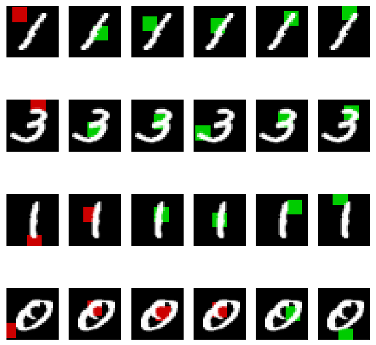
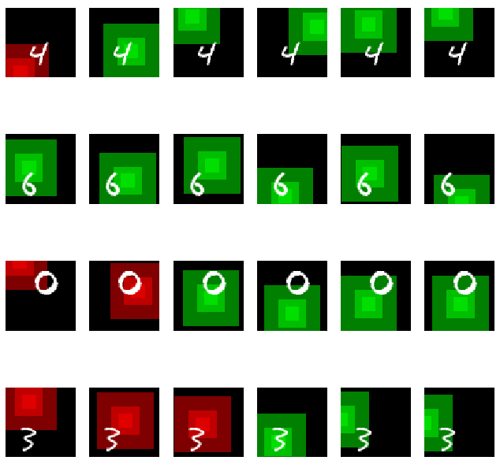

## Recurrent Models of Visual Attention in Tensorflow

Implementation of https://arxiv.org/abs/1406.6247, "Recurrent Models of Visual Attention" V. Mnih et al.

In visualizations, the colored squares represent the current glimpse locations. Shades are used to represent glimpse locations at multiple scales. Glimpses are shaded green/red depending on whether the agent is predicting the correct class label at that timestep.

## Usage

For MNIST:

    $ python train_ram.py

For MNIST-translate (60x60):

    $ python train_ram.py --translate

## Results

Approximately replicate results from the above paper on MNIST and MNIST-translate datasets.

Test error after 300 epochs:

MNIST, 6-glimpses, 1 scale: ~1.3%

MNIST-translate 60x60, 6-glimpses, 3 scales: ~2.2%

## Example Glimpse Trajectories

MNIST:

MNIST-translate 60x60:

